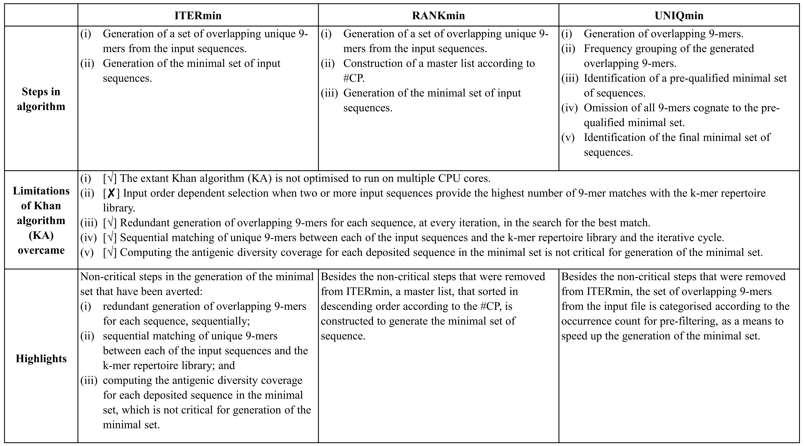

# ITERmin: An alignment-independent tool for the study of pathogen sequence diversity

Table of Contents
====================
- [Brief Description](#brief-description)
- [Quick Start](#quick-start)
    + [Step 1: Generation of a set of overlapping unique *k*-mers from input sequences](#step-1---generation-of-a-set-of-overlapping-unique-k-mers-from-the-input-sequences)
    + [Step 2: Generation of the minimal set of input sequences](#step-2---generation-of-the-minimal-set-of-input-sequences)    

---
## Brief Description
ITERmin consideration of the limitations of using the extant KA, three different tools were developed to overcome as many of them and to make the algorithm big-data ready. The three tools (ITERmin, RANKmin and UNIQmin) were a result of sequential effort in, first, overcoming the limitations in terms of optimising the minimal set and subsequently, in optimizing the run-time performance of the tools.min was developed to overcome as many of the issues of KA (referred to figure below) and to make the algorithm big-data ready. 

RANKmin (https://github.com/ChongLC/MinimalSetofViralPeptidome-RANKmin)

UNIQmin (https://github.com/ChongLC/MinimalSetofViralPeptidome-UNIQmin)

---
## Quick Start
As with any typical tool, an input file would be required to deliver the output, with user-defined parameters for optimal outcome. The input would be a file containing a set of non-redundant (nr) protein sequences in the FASTA format. Sequences containing the unknown residue, X, may be removed, if desired. Keeping them may result in a minimal set comprising of sequences with the unknown residue.

Below we describe the algorithmic steps of the tool: 

#### Step 1 - Generation of a set of overlapping unique k-mers from the input sequences
Use the sample non-redundant (nr) input file to generate a set of defined overlapping *k*-mers (e.g. 9-mers; other *k*-mers length can also be defined) from each of the sequences in the input file. Identical *k*-mers in the dataset are removed, resulting in a new file, containing only the unique *k*-mers. This step is carried out by employing the "I1_UniqueKmerGenerator" script.

#### Step 2 - Generation of the minimal set of input sequences
Match between the unique overlapping *k*-mers and the input sequence, and subsequently, identify the sequence with the maximal *k*-mers coverage, which are then deposited into a new file (minimal set). The deposited sequences in the minimal set and their inherent *k*-mers are removed. This process is repeated until the unique overlapping *k*-mers are exhausted. This step is carried out by use of the "I2_MinSetGenerator" script.

---

In the quest to achieve the speed and optimality, UNIQmin was developed and explained here (https://github.com/ChongLC/MinimalSetofViralPeptidome-UNIQmin). 
